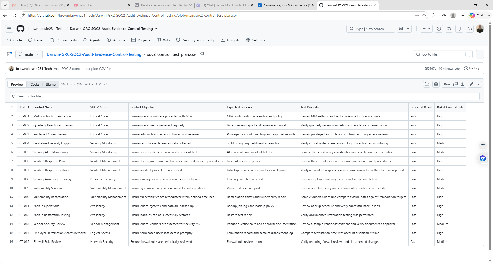
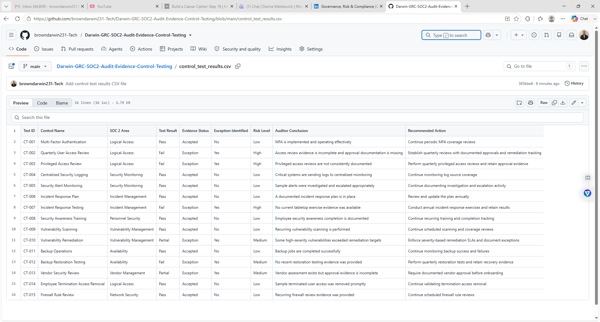
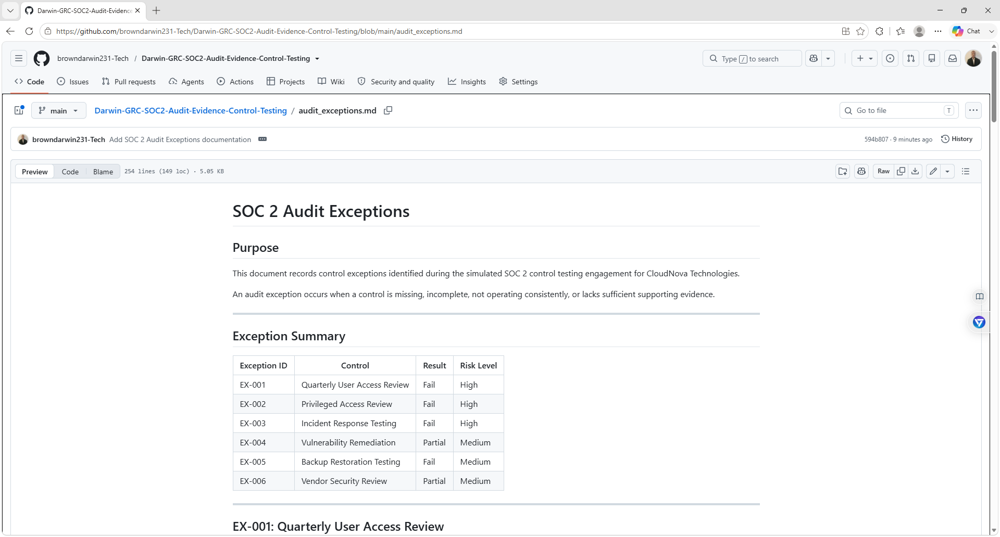

# Darwin-GRC-SOC2-Audit-Evidence-Control-Testing

Hands-on GRC project simulating SOC 2 audit evidence collection, control testing, exception tracking, and remediation recommendations.

- SOC 2 control testing
- Audit evidence collection
- Control design review
- Operating effectiveness testing
- Exception documentation
- Risk assessment
- Remediation tracking
- Compliance documentation
- Audit readiness

## Business Scenario

CloudNova Technologies is preparing for a SOC 2 audit.

The organization has several security controls in place, including:

- Multi-Factor Authentication
- User access reviews
- Security logging
- Incident response procedures
- Security awareness training
- Vulnerability management
- Backup and recovery
- Vendor risk management

The audit will determine whether these controls are properly designed and operating effectively.

## Audit Scope

The simulated audit focuses on SOC 2-related control areas including:

- Logical Access
- Security Monitoring
- Incident Management
- Change Management
- Vulnerability Management
- Security Awareness
- Vendor Management
- Availability
- Risk Management

## Control Testing Method

Each control is reviewed using:

1. Control Objective
2. Expected Evidence
3. Evidence Received
4. Test Procedure
5. Test Result
6. Exception Identified
7. Risk Level
8. Remediation Recommendation

## Control Testing Summary

| Control | Area | Test Result | Risk |
|---|---|---|---|
| Multi-Factor Authentication | Logical Access | Pass | Low |
| Quarterly Access Review | Logical Access | Fail | High |
| Centralized Security Logging | Security Monitoring | Pass | Low |
| Incident Response Plan | Incident Management | Pass | Low |
| Incident Response Testing | Incident Management | Fail | High |
| Security Awareness Training | Personnel Security | Pass | Low |
| Vulnerability Remediation | Vulnerability Management | Partial | Medium |
| Backup Restoration Testing | Availability | Fail | Medium |
| Vendor Security Review | Vendor Management | Partial | Medium |
| Privileged Access Review | Logical Access | Fail | High |

## Example Audit Evidence

Evidence collected may include:

- MFA configuration screenshots
- User access review reports
- Security log screenshots
- Incident response documentation
- Training completion records
- Vulnerability scan reports
- Backup restoration reports
- Vendor security questionnaires
- Privileged-access review reports

## Audit Findings

### Finding 1: Quarterly Access Review

**Result:** Fail

**Risk Level:** High

Quarterly access reviews were not consistently completed or documented.

**Recommendation:** Establish a formal quarterly access review process and retain evidence of reviewer approval and remediation actions.

### Finding 2: Incident Response Testing

**Result:** Fail

**Risk Level:** High

An incident response plan exists, but no recent tabletop exercise evidence was available.

**Recommendation:** Conduct annual tabletop exercises and retain documentation showing participants, scenarios, findings, and corrective actions.

### Finding 3: Backup Restoration Testing

**Result:** Fail

**Risk Level:** Medium

Backups are performed, but restoration testing is inconsistent.

**Recommendation:** Conduct quarterly backup restoration tests and retain evidence showing recovery success and recovery times.

### Finding 4: Privileged Access Review

**Result:** Fail

**Risk Level:** High

Administrator accounts are not reviewed consistently.

**Recommendation:** Perform quarterly privileged-access reviews and document approvals, removals, and exceptions.

## Audit Result Categories

- Pass – Control is implemented and operating effectively
- Partial – Control exists but has weaknesses
- Fail – Control is missing or not operating effectively
- Not Tested – Insufficient evidence available

## Repository Structure

Darwin-GRC-SOC2-Audit-Evidence-Control-Testing/
│
├── README.md
├── soc2_control_test_plan.csv
├── audit_evidence_log.csv
├── control_test_results.csv
├── audit_exceptions.md
├── remediation_actions.md
└── evidence/

## Evidence Screenshots

### SOC 2 Control Test Plan

### Control Test Results

### Audit Exceptions

## Skills Demonstrated

- SOC 2
- GRC
- Control Testing
- Audit Evidence Collection
- Audit Readiness
- Control Effectiveness Testing
- Exception Management
- Compliance Documentation
- Risk Assessment
- Remediation Tracking
- Identity and Access Management
- Incident Response
- Vendor Risk Management

## Project Goal

The goal of this project is to demonstrate the ability to perform a simulated SOC 2 control assessment by collecting evidence, testing controls, identifying exceptions, evaluating risk, and documenting remediation recommendations.
